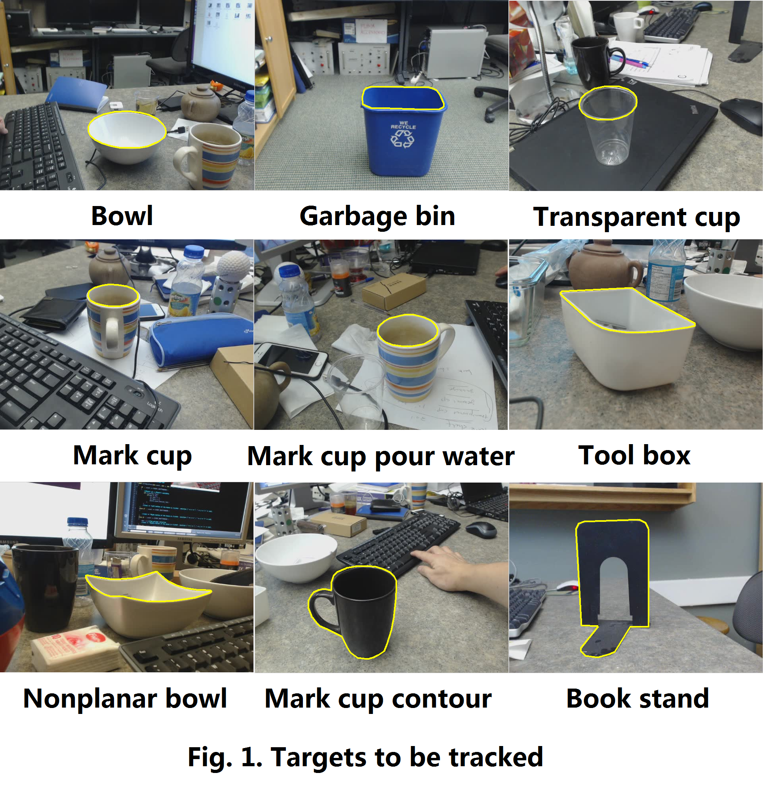

Dataset of Salient Closed Boundary Tracking
====

This dataset contains nine video sequences captured by a webcam for salient closed boundary tracking evaluation, as shown in Fig. 1.

 

PARAMETERS: 
FPS: 30 
Frame size: 640(width) x 480(height) 
Total frames: 9598 

Frame numbers of each sequence:  
1.BookStand.avi:		899 
2.Bowl.avi:			1079 
3.GarbageBin.avi:		924 
4.MarkCup.avi:			859 
5.MarkCupContour.avi:		1226 
6.MarkCupPourWater.avi:		971 
7.NonplanarBowl.avi: 		1454 
8.ToolBox.avi:			1135 
9.TransparentCup.avi: 		1051 

For each frame, there are two kinds of ground truth:  

(1) POLYGON based ground truth in the folder "GroundTruthByPolygons". 
--
The <xxx_TrackingGroundTruth.txt> are organized as follows: 
points_number x1 y1 x2 y2 x3 y3 ... ... xn yn 

Xuebin Qin, Shida He, Camilo Perez Quintero, Abhineet Singh, Masood Dehghan and Martin Jagersand. "Real-time salient closed boundary tracking via line segments perceptual grouping." accepted in the IEEE/RSJ International Conference on Intelligent Robots and Systems (IROS), September 2017. 

(2) BOUNDARY based ground truth in the folder "GroundTruthByBoundaries". 
--
Accurate and smooth one-pixel-width boundaries are represented by .png binary images. 

Xuebin Qin, Shida He, Zichen Zhang, Masood Dehghan and Martin Jagersand. "Real-time salient closed boundary tracking using perceptual grouping and shape priors." accepted in the 28th British Machine Vision Conference (BMVC), September 2017. 

If you have any problems or suggestions, feel free to contact us. 

The code can be found https://github.com/NathanUA/SlientClosedBoundaryTracking. 

Contacts
---
Xuebin Qin 
Department of Computing Science 
University of Alberta 
Edmonton, AB, Canada, T6G 2E8 

Email: 
xuebin@ualberta.ca 
